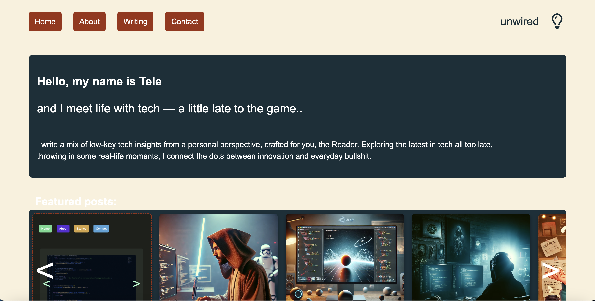

# UNWIRED



**Deployed website:** [unwired](https://unwired.netlify.app/)<br/>
A low-key tech blog website created as my exam during 1st year at Noroff School of Technology.

## Description

The design started off as a basic website blog, following the [brief](BRIEF.md) for creating a home, about, contact, blog-list and post page. The project grew organically to include some additional features as listed below. Blog posts and comments are dynamically fetched from a Wordpress instance, utilising the Wordpress REST API with GET and POST calls.

**Additional features:**

- Color mode toggle where users can choose between multiple color themes
- Filters for titles, categories + sorting asc/desc in the blog-list page
- User can alter how the view of the post pages

## Built With

- [One.com](https://www.one.com/en/) / Hosting the Wordpress instance
- [Wordpress](https://wordpress.org/) / For the Wordpress instance
- [Netlify](https://app.netlify.com/) / Deploying the website
- [IBMEqualAccess](https://github.com/IBMa/equal-access) / Accessibility Checker with browser integration
- Javascript, HTML, CSS
- node.js
- **IDE:** Visual Studio Code

## Installing and running

1. Clone the repo:

```bash
git clone git@github.com:telecasteren/project-exam-1-tele-c.git
```

2. Run with Live server locally.<br/>
   You may play around with it on your machine as you like, and if you want to contribute, read more in the section [Contributing](#contributing).

## Contributing

If you want to contribute to this project, you are welcome to do so.<br/>
The only requirements is that you keep the intention of the website, that it being a blog, and make sure to open a pull request (PR) so code can be reviewed before it's implemented.<br/>

**To keep the project stable and maintainable, please follow these general guidelines:**

1. **Fork & Clone** – Fork the repository and clone it to your local machine.
2. **Create a Branch** – Use a descriptive branch name (feature-new-component or fix-bug-123).
3. **Keep Site Integrity** – Ensure your changes do not break existing functionality or design consistency.
4. **Write Clean Code** – Follow the project’s coding style and best practices.
5. **Test Your Changes** – If applicable, test your changes before submitting.
6. **Submit a Pull Request** (PR) – Open a PR with a clear description of your changes. The maintainers will review it and provide feedback if needed.

**Known areas for improvements:**

- Ability to edit comments through user login
- Admin user abilities to edit posts
- Landing page performance
- Blog-list page performance

## Contact

- [My website - telecasternilsen](https://telecasternilsen.netlify.app/)
- [GitHub profile](https://github.com/telecasteren)
- [LinkedIn profile](https://www.linkedin.com/in/tele-caster-nilsen-7002b9249/)

## Acknowledgments

- ChatGPT for his help in generating most of the blog-posts text content and images.
- My fiancé for testing and providing me constructive criticism on design and interaction.
